<link rel="stylesheet" type="text/css" href="assets/css/custom.css" />

## Peter McAughan, Arvind Krishnakumar, James Hahn, Shreeshaa Kulkarni

&nbsp;
&nbsp;

| 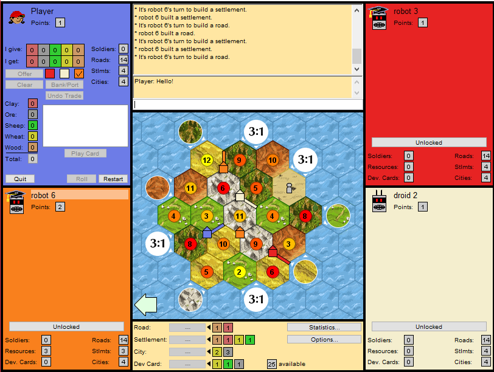 | 

| *Settlers of Catan Game UI* |

## What is Settlers of Catan?

Settlers of Catan is a very popular board game created by Klaus Teuber in 1995 and has been played all over the world for almost 25 years. It is a four-player game that involves rolling dice, collecting resources, and building a settlement that eventually is successful enough to win the game. Although rolling dice and preparing a building strategy is enjoyable, one of the most fun aspects of the game comes from its social component. Throughout the game, players negotiate with each other, proposing trades for various resources and choosing which trades to decline or accept.

From an Artificial Intelligence perspective, developing an agent for this game is an interesting challenge. On one hand, a player must create a building policy to prioritize certain structures in certain locations. On the other hand, a player must utilize the resources of others: only proposing and accepting trades that are most beneficial to the player.

## Current State of the Art

The 'world champion' standard of AI for this board game is a program called [JSettlers](http://nand.net/jsettlers/), developed by [Jeremy Monin](http://www.nand.net/~jeremy/home.htm) over 10 years ago and still in active development today (he gave some advice for this project!). This program is developed in Java and contains a fully-implemented framework of the board game as well as an entirely rule-based agent with hard-coded decisions and heuristics. The existing research surrounding Settlers of Catan use this agent as a benchmark, but no attempts to develop a new Settlers of Catan AI have been able to be significantly better than the JSettlers agent to date.

## The DQN Algorithm

### Introduction

The DQN, or Deep Q-Learning Network, algorithm is a novel approach to reinforcement learning proposed by [the DeepMind team in 2013](https://www.cs.toronto.edu/~vmnih/docs/dqn.pdf). As a quick refresher on reinforcement learning, take a look at the graphic below. In a model with an agent and an environment, the goal of reinforcement learning is to develop a policy such that an agent can find itself in a particular state, query its policy, and perform the corresponding action such that its reward is maximized.

|  | 
| *Source: https://www.kdnuggets.com* |

&nbsp;

Q-Learning is a technique to develop such a policy by maintaining a large table with expected rewards (Q values) for every (state, action) pair. The agent will simply look at every action that it can take within a state, and execute the action with the largest Q-value. However, in a large state space with a large amount of possible actions, this table becomes infeasible to keep and thoroughly 'fill out'. 

Deep Q-Learning is an alternative approach to Q-Learning that doesn't face these issues. It involves utilizing a deep neural network (CNN) to approximate the Q value for (state, action) pairs instead of a table like classical Q-Learning. DQN is very efficient when there is a large state space with a large amount of actions, as it can estimate a Q-value for a never-seen-before state by comparing how similar it is to known states. This algorithm has seen success with game-playing in the context of Atari and Pacman, as opposed to the classical Q-Learning approach. Take a look at the graphic below for a basic representation of these two approaches:

| 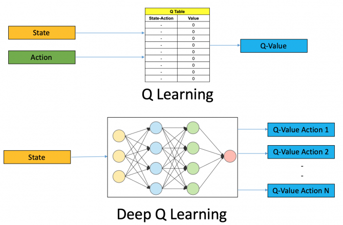 | 
| *Source: https://www.analyticsvidhya.com* |

&nbsp;
&nbsp;

## Our Goals

Our goal for this project was to use this DQN algorithm to improve upon the JSettlers agent and show that a DQN can be successfully applied to the game mechanics of Settlers of Catan. Our original proposal had plans to implement both mechanics of the game: building and negotiating. Given some time and resource constraints, however, we decided to only implement negotiation decisions in our agent. Building an agent that utilizes DQN to play the entire game is outside the scope of this work; we are simply building upon the JSettlers agent by replacing rule-based decisions by DQN output where applicable. 

## DQN Design

### Constructing Feature Vectors

As shown in the diagram above, we have to define what our 'state' really is as well as the possible actions to take in that state. The amount of information available to the agent and the possible actions depend on which environment the game is in: negotiation or building. Thus, we created two DQNs that will handle negotiation and building respectively. 

For each DQN, we have to define what a 'state' is as a feature vector. In Settlers of Catan, there are a huge number of features in a game state: what buildings each player has, where these buildings are, what the terrain is like, how many points each player has, and many more. We elected not to use every single feature in a state representation as the network would require more training time to learn which are relevant and which are not. By using prior knowledge and only providing relevant features to the network, we hypothesize training to be more efficient. The diagrams below show our constructed feature vectors for each network:

| 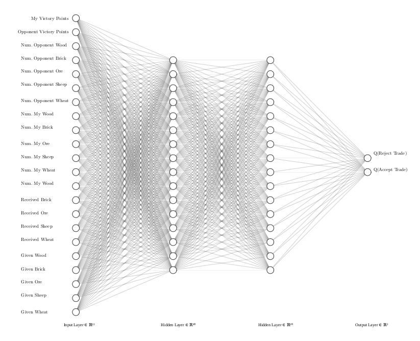| 

| *DQN for Trade Decisions* |

&nbsp;

<!-- | | 

| *DQN for Settlement Scoring* |

&nbsp;
&nbsp; -->

### Neural Net Hyperparameters

We performed some basic testing to determine the hyperparameters for the neural network architecture above. These hyperparameters are as follows:

1. Number of hidden layers: 2
2. Size of hidden layers: 256

The values for other hyperparameters are shown explained in the following sections. 

### Defining and Exploring the Reward Space

In order for the model to learn what is successful and what isn't, we need to feed it rewards as it takes more and more actions. In a more ideal game, we can feed a reward at every step such that the agent can map immediate actions to immediate rewards. In Settlers of Catan and more complex games, however, it is the case that we don't know how successful a move is until the very end of the game. The patterns of these long term rewards are harder for a model to learn, and makes for a challenging reinforcement learning problem. We have defined our rewards as the following, and the agent only receives this reward at the end of every game:

1. First place: +10
2. Second place: +7
3. Third place: +4
4. Last Place: 0

Additionally, the agent has to explore all the different actions in different states that it can take. Sometimes, an agent should choose an action that it thinks is less successful in an attempt to learn more about the action space during training. There are many techniques to explore the state, action, and reward space, and we chose a technique called **Epsilon-Greedy Policy Improvement**. 

In this technique, we have a parameter epsilon that is initialized to a high value, such as .999. Whenever we have to make a decision, we generate a random number and if it is greater than epsilon, we return a completely random action without querying our network. If this random number is less than epsilon, we actually perform forward propogation on our network and return the result. In both scenarios, we train our network on the resultant reward. After every decision is made, we update epsilon by a decay factor:

| | 

|  |

&nbsp;

This represents the process of our agent becoming 'more sure' of itself as it trains more and more, while still exploring spaces where the expected reward is unknown. For our model, we used the following values for these parameters:

||

|  |

&nbsp;
&nbsp;

### Replay Memory

With a neural network, it's often inefficient to train on single data points and perform back-propogation for every observation in your dataset, and so these models are typically trained in batches such that the model trains on batches of data at one time. With reinforcement learning, it's intuitive to train every time you perform an action and get feedback, but we run into the same efficiency problem. To solve this, we keep a database of 'short-term memory', and every time the agent performs an action and gets feedback we place this 'experience' in our database. We do want to train on new experiences, so when we add a new experience in our database, we remove the oldest experience.

This database of short-term memory is called **Replay Memory**. Now, every time we want to update our weights we randomly select a number of experiences from our replay memory and use them as a batch to train our model. The replay memory size as well as training batch size are two parameters that need to be optimized, and for this project we use the following values: 

| | 
|:--:| 
| |

&nbsp;
&nbsp;

## System Architecture Design

A large part of this project involved modifying the original JSettlers code to interface with our DQN, which required understanding the underlying architecture of JSettlers and altering it to our needs. The framework of JSettlers is comprised of the following main components, all written in Java:

**JSettlers Server:** Server that hosts the game and sends messages between clients

**DQNClient:** Player-side client. Connect to a server to play a game.

**JSettlers Bots:** Internal AI agents running in the server itself

**Brain Module:** Contains all the decision-making logic. Takes game state & queries from Client and returns decision.

Our DQN code was all written in Python, and is implemented in the component:

**DQN Server:** Server that accepts game states and queries from a client and returns decisions while training the underlying model.

To implement our own agent, we had to create our own Client and Brain that interface both with the Server for game management and our DQN Server for decision logic. This initial architecture is shown in the diagram below:

| 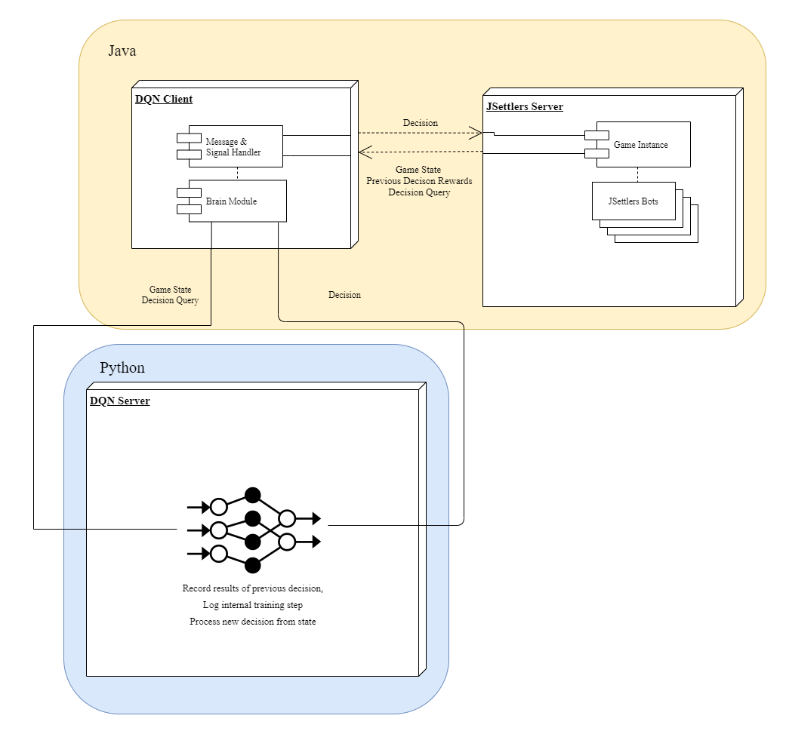| 
|:--:| 
| *Initial Pipeline Design* |

&nbsp;
&nbsp;

After designing and implementing this, however, we realized that a connection from a server to a client to another server led to some unnecessary connection complexity, so we further 'tricked' the JSettlers game server to locally instantiate our Client and Brain as if it were an internal JSettlers AI. In this way, we can run our agent on the server itself and ignore connecting to the server with our client. This simplifies the experiment setup process and makes the pipeline faster and more robust at the cost of some clever framework manipulaton. This improved architecture is shown in the diagram below:

| 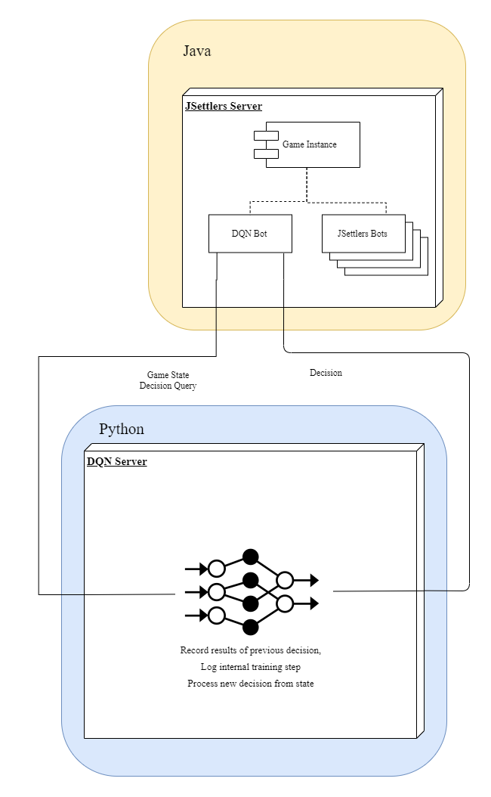| 
|:--:| 
| *Improved Pipeline Design* |
 
&nbsp;
&nbsp;

## Training Design

To effectively let the agent play games and learn, we had the following goals:

1. Eliminate the GUI to speed up gameplay
2. Automate the starting of games
3. Automate the recording of game results
4. Eliminate as much latency & communication complexity as possible

With some great features already existing inside JSettlers and creating some additional features, we accomplished these goals and had a very user-friendly training pipeline that could be run by a one simple command line input. Once the user prompts this pipeline, the training logic flow is as follows:

1. Instantiate our agent & ensure it's connected to the DQN decision center
2. Start a game with 3 JSettlers AI and our agent without using a GUI.
3. Whenever our agent needs to make one of the decisions we have implemented with DQN, send a query with the current state representation to the DQN Server.
4. Get the response, execute the decision, and return the consequences to the DQN server for training.
5. If the game has ended, report the agent's final standing to the DQN server for training.
6. Repeat until 200 games have been played.
7. Save model weights and performance logs.

The training process for 138 games took around 9 hours and 15 minutes to run on a standard CPU, averaging about 15 games per hour. 

## Results

| 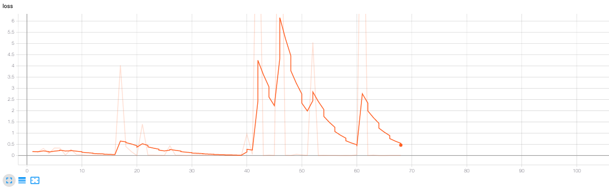{:height="400px" width="1200px"} | 
|:--:| 
| *Training loss vs Episodes - 68 episodes* |

---

| 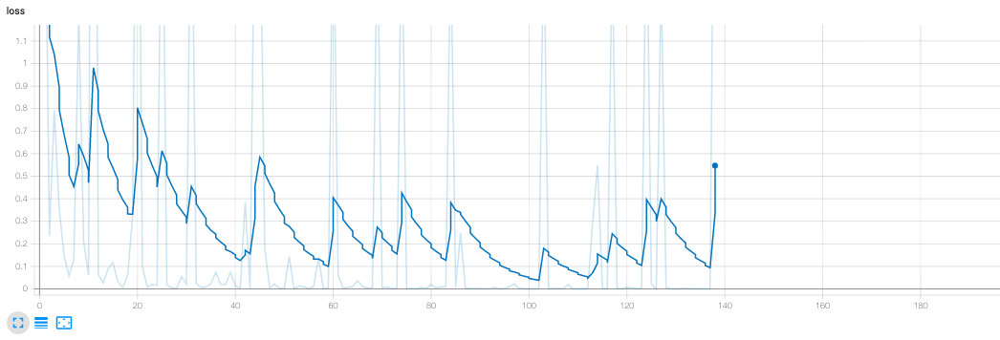{:height="400px" width="1200px"} | 
|:--:| 
| *Training loss vs Episodes - 138 episodes* |

---

| {:height="450px" width="1200px"} | 
|:--:| 
| *Model Accuracy vs Episodes - 68 episodes* |

---

| 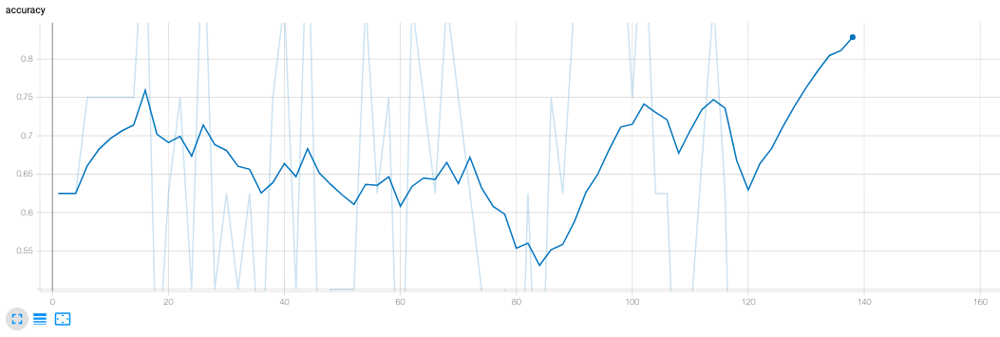{:height="450px" width="1200px"} | 
|:--:| 
| *Model Accuracy vs Episodes - 138 episodes* |

---

| 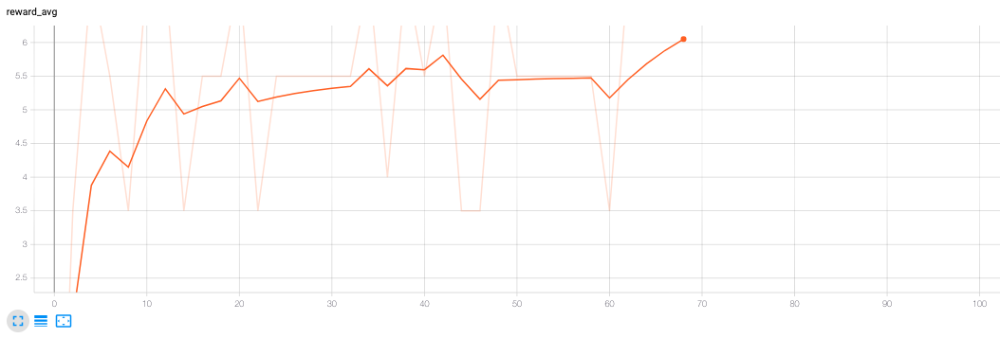{:height="450px" width="1200px"} | 
|:--:| 
| *Average Rewards vs Episodes - 68 episodes* |

---

| 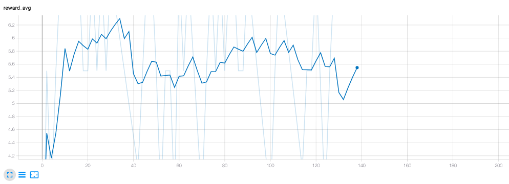{:height="450px" width="1200px"} | 
|:--:| 
| *Average Rewards vs Episodes - 138 episodes* |

---

| 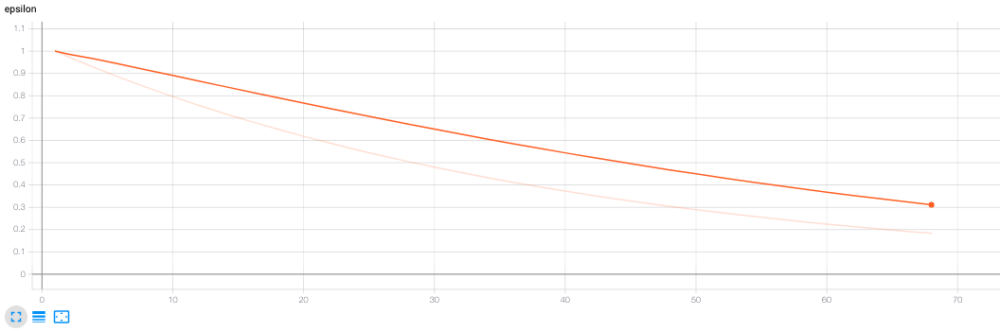{:height="450px" width="1200px"} | 
|:--:| 
| *Epsilon vs Episodes - 68 episodes* |

---

| 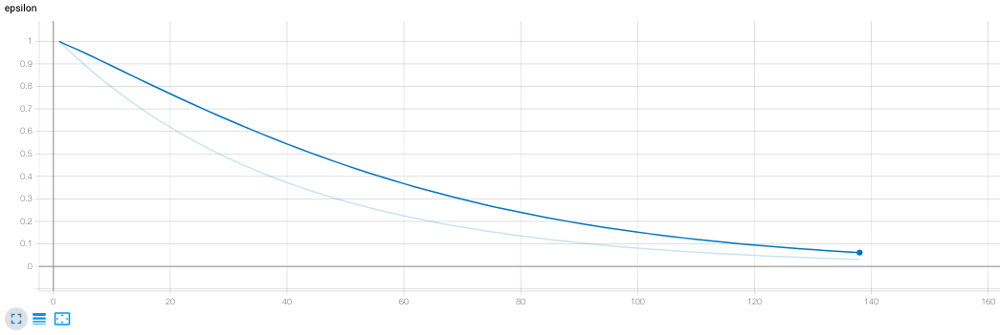{:height="450px" width="1200px"} | 
|:--:| 
| *Epsilon vs Episodes - 138 episodes* |

&nbsp;
&nbsp;

## Discussion

We're overall pleased with the performance of our model. Our loss metric has a general downward trend, spiking up after every 4 episodes. This makes sense, as the method used to calculate loss is updated every couple of episodes. Given more training time, we see this loss approaching a very small value

Our average reward is also increasing up to a value of 6, and the reward graph shows a great deal of improvement. From getting last place every time, our agent is now consistently getting second place. This does mean that the agent is very infrequently 'winning' the game. We can attribute this to a shortcoming of training, or the fact that we're only altering trading mechanics in the game. Even with perfect negotiation ability, a player can still lose the game if their building decisions are suboptimal. Likely, all of these factors play a role in our agent's total performance.

One large obstacle in this project were errors within the JSettlers framework itself. Playing a game without player clients is a newer feature to the Jeremy Modin's project, and when there are only AI agents playing against eachother there are frequent errors. The results of around 35% of total games had to be discarded due to unexpected game resets or other internal errors. This made training on a consistent number of games somewhat difficult. 

## Future Possibilites

A major part of this project involved developing the architecture that supports DQN integration with the Settlers of Catan framework. While we applied this reinforcement learning to two mechanics in the game, namely considering offers and choosing preferred settlements to build, in theory, every single game decision can be implemented using a DQN with this architecture. Examples of some game decisions that we thought of experimenting with were:

1. Offering Trades
2. Building Roads
3. Time & place to move a robber
4. Investing in Development Cards
5. Targeting specific players in some scenarios

Given enough time and understanding of the game, this project can be extended to create an AI agent completely independent of the JSettlers agent. The results of such an endeavor are unclear, but the possibility is there!

## References 

- JSettlers: http://nand.net/jsettlers/

- DQN Tutorial: https://pythonprogramming.net/deep-q-learning-dqn-reinforcement-learning-python-tutorial/

- DQN Algorithm: https://www.cs.toronto.edu/~vmnih/docs/dqn.pdf
